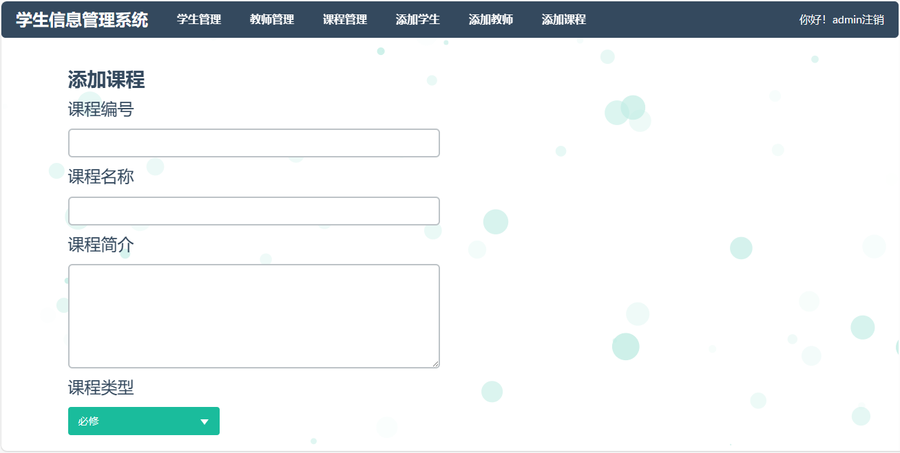

<h1 align="center">23.基于ssm的学生信息管理系统</h1>

- <b>完整代码获取地址：从戎源码网 ([https://armycodes.com/](https://armycodes.com/))</b>
- <b>技术探讨、资料分享，请加QQ群：692619798</b> 
- <b>作者微信：19941326836  QQ：952045282</b> 
- <b>承接计算机毕业设计、Java毕业设计、Python毕业设计、深度学习、机器学习</b>
- <b>选题+开题报告+任务书+程序定制+安装调试+论文+答辩ppt 一条龙服务</b>
- <b>所有选题地址 ([https://github.com/YuLin-Coder/AllProjectCatalog](https://github.com/YuLin-Coder/AllProjectCatalog)) </b>

## 项目介绍

基于ssm的学生信息管理系统：由SpringMVC+MyBatis为主要框架，mysql配置主从复制实现读写分离。前端主要由bootstrap完成，背景用particles.js插件。数据库交互查询用到pagehelper分页。在添加修改相关功能时通过ajax来验证其主键是否存在可用。代码层次清晰，输入框约束较高，已配置登录拦截。

## 主要功能

### 学生

- 选课：按课程编号查询、按课程名称查询、按所属学院查询、按课程类型查询、课程列表、选课操作、确定选课、查看选课结果、退选课程
- 已修课程：已修课程列表（课程编号、课程名、成绩、学分）
- 个人信息管理：个人信息查看、密码修改

### 老师

- 添加教学课程：按课程编号查询、按课程名称查询、按所属学院查询、按课程类型查询、课程列表、选择课程、课程已有老师代课无法选择
- 管理教学课程：教学课程列表、教学课程修改、教学课程删除、每个老师只能查看到自己的教学课程
- 查看选课名单和结果：选课总览列表、查看名单、查看结果、查询成绩、选课学生名单、录入成绩、成绩列表
- 管理本人信息：个人信息查看、密码修改

### 管理员

- 学生管理：学生列表、条件搜索查询、添加学生、学生信息修改、学生信息删除
- 教师管理：教师列表、条件搜索查询、添加教师、教师信息修改、教师信息删除
- 课程管理：课程列表、条件搜索查询、添加课程、课程信息修改、课程信息删除

## 环境

- <b>IntelliJ IDEA 2021.3</b>

- <b>Mysql 5.7.26</b>

- <b>Tomcat 7.0.73</b>

- <b>JDK 1.8</b>

## 运行截图

